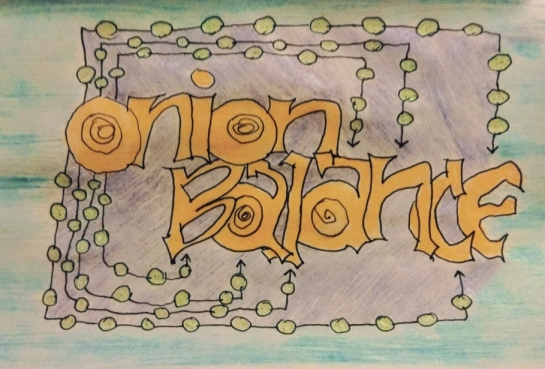

OnionBalance
============

Introduction
------------

OnionBalance allows Tor onion service requests to be distributed across
multiple backend Tor instances. OnionBalance provides load-balancing while also
making onion services more resilient and reliable by eliminating single
points-of-failure.

|build-status| |docs|

Getting Started
---------------

Installation and usage documentation is available at https://onionbalance.readthedocs.org.

Contact
-------

This software is under active development and likely contains bugs. Please
open bug reports on Github if you discover any issues with the software or
documentation.

::

    pub   rsa4096 2012-02-22 [SC]
          13C81580203AE18BB7C0424E09CC7F5315F271D9
    uid           [ultimate] George Kadianakis <asn@torproject.org>
    uid           [ultimate] George Kadianakis <desnacked@riseup.net>
    sub   rsa4096 2012-02-22 [E]

The Onionbalance software was originally authored and maintained by Donncha Ó
Cearbhaill. Thanks for all the code!!!

.. |build-status| image:: https://img.shields.io/travis/asn-d6/onionbalance.svg?style=flat
    :alt: build status
    :scale: 100%
    :target: https://travis-ci.org/asn-d6/onionbalance

.. |coverage| image:: https://coveralls.io/repos/github/asn-d6/onionbalance/badge.svg?branch=master
    :alt: Code coverage
    :target: https://coveralls.io/github/asn-d6/onionbalance?branch=master

.. |docs| image:: https://readthedocs.org/projects/onionbalance-v3/badge/?version=latest
    :alt: Documentation Status
    :scale: 100%
    :target: https://onionbalance.readthedocs.org/en/latest/
