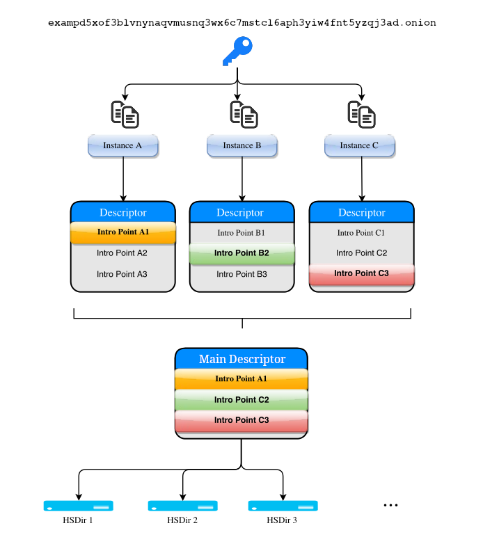

# Onionbalance Design Document

Onionbalance is designed to allow requests to [Tor Onion Services][] to be
directed to multiple back-end Tor instances, thereby increasing
availability and reliability. The design involves collating the set of
introduction points created by one or more independent Onion Service
instances into "main" descriptors.

Onionbalance implements a [round-robin][]-like load balancing on top of
[Tor Onion Services][]. A typical Onionbalance deployment will incorporate at
least one frontend servers and multiple backend instances.

[round-robin]: https://en.wikipedia.org/wiki/Round-robin_DNS
[Tor Onion Services]: https://community.torproject.org/onion-services/

Last updated on 2025-01-27.

!!! note "Differences between design and implementation"

    There might be differences between the design and the
    actual Onionbalance implementation.

    This document may be updated whenever these differences
    are detected, to make sure both design and code are
    in sync.

    If you find any discrepancies or innacuracies, please
    open an issue or send a merge request.

## Overview

Main descriptors are signed by the onion service permanent key and
[published to the HSDir system as normal][rend-spec-overview].

[rend-spec-overview]: https://spec.torproject.org/rend-spec/overview.html

Clients who wish to access the onion service would then retrieve a
main service descriptor and try to connect to introduction points
from the descriptor in a random order. If a client successfully
establishes an introduction circuit, they can begin communicating with
one of the onion services instances with the normal onion service
protocol defined in the [Onion Services specification][rend-spec].

[rend-spec]: https://spec.torproject.org/rend-spec

## Components

* **Backend Instance**: a load-balancing node running an individual onion
  service. Each backend application server runs Tor onion services with unique
  onion service keys.
* **Management Server**, also known as the "frontend" or "publisher node": a
  server running Onionbalance which collates introduction points and publishes
  a main descriptor. It's the machine running the Onionbalance daemon. It
  needs to have access to the onion service private key corresponding for the
  desired onion address. This is the public onion address that users will
  request.
  This machine can be located geographically isolated from the machines hosting
  the onion service content. It does not need to serve any content.
* **Main Descriptor** (formerly known as "master" descriptor): an onion service
  descriptor published with the desired onion address containing introduction
  points for each backend instance.
* **Introduction Point**: a Tor relay chosen by an onion service instance as a
  medium-term *meeting-place* for initial client connections.
<!--
* **Metadata Channel**: a direct connection from an instance to a management server
  which can be used for instance descriptor upload and transfer of other data.
-->

## Architecture

The management server runs the Onionbalance daemon. Onionbalance
combines the routing information (the introduction points) for multiple
backend onion services instances and publishes this information in a
main descriptor.

The backend application servers run a standard Tor onion service. When a
client connects to the public onion service, it selects one of the
introduction points at random. When the introduction circuit completes,
the user is connected to the corresponding backend instance.

## Retrieving Introduction Point Data

The core functionality of the Onionbalance service is the collation of
introduction point data from multiple onion service instances by the
management server.

In its basic mode of operation, the introduction point information is
transferred from the onion service instances to the management server
via the HSDir system. Each instance runs an onion service with an
instance specific permanent key. The instance publishes a descriptor to
the DHT at regularly intervals or when its introduction point set
changes.

On initial startup the management server will load the previously
published main descriptor from the DHT if it exists. A main
descriptor is used to prepopulate the introduction point set. The
management server regularly polls the HSDir system for a descriptor for
each of its instances.

When the management server receives a new descriptor from the HSDir
system, it should perform a number of checks to ensure that it is valid,
like:

* Confirm that the descriptor has a valid signature and that the public key
  matches the instance that was requested.
* Confirm that the descriptor timestamp is not too long in the past. An older
  descriptor indicates that the instance may no longer be online and publishing
  descriptors. The instance should not be included in the main descriptor.
<!--
  The following is no longer the case, as rend-spec-v3 has built-in replay
  attack protections using the revision-counter descriptor field which
  is indexed by the blinded public key on descriptor caches.
-->
<!--
* Confirm that the descriptor timestamp is equal or newer than the previously
  received descriptor for that onion service instance. This reduces the ability
  of a HSDir to replay older descriptors for an instance which may contain
  expired introduction points.
-->

It should be possible for two or more independent management servers to
publish descriptors for a single onion service. The servers would
publish independent descriptors which will replace each other on the
HSDir system.. Any difference in introduction point selection between
descriptors should not impact the end user.

## Choice of Introduction Points

Tor onion service descriptors can include a maximum of introduction points up
to the descriptor size limit. Onionbalance should select introduction points so
as to uniformly distribute load across the available backend instances.

<!--
  The following was valid for v2, but not for Onionbalance v2 as
  of 2025-01-22. This may need to be updated once Distinct Descriptor
  Mode is available: https://gitlab.torproject.org/tpo/onion-services/onionbalance/-/issues/7
-->
<!--
Onionbalance will upload multiple distinct descriptors if you have
configured more instances than what fits in a single descriptor.

* **1 instance** - 3 IPs
* **2 instance** - 6 IPs (3 IPs from each instance)
* **3 instance** - 9 IPs (3 IPs from each instance)
* **4 instance** - 10 IPs (3 IPs from one instance, 2 from each other
    instance)
* **5 instance** - 10 IPs (2 IPs from each instance)
* **6-10 instances** - 10 IPs (selection from all instances)
* **11 or more instances** - 10 IPs (distinct descriptors - selection
    from all instances)

Always attempting to choose 3 introduction points per descriptor may
make it more difficult for a passive observer to confirm that a service
is running Onionbalance. However behavioral characteristics such as the
rate of introduction point rotation may still allow a passive observer
to distinguish an Onionbalance service from a standard Tor onion
service. Selecting a smaller set of introduction points may impact on
performance or reliability of the service.

* **1 instance** - 3 IPs
* **2 instances** - 3 IPs (2 IPs from one instance, 1 IP from the
    other instance)
* **3 instances** - 3 IPs (1 IP from each instance)
* **more than 3 instances** - Select the maximum set of introduction
    points as outlined previously.
-->

It may be advantageous to select introduction points in a non-random
manner. The longest-lived introduction points published by a backend
instance are likely to be stable. Conversely selecting more recently
created introduction points may more evenly distribute client
introductions across an instances introduction point circuits. Further
investigation of these options should indicate if there is significant
advantages to any of these approaches.

## Generation and Publication of Main Descriptor

The management server should generate a onion service descriptor
containing the selected introduction points. This main descriptor is
then signed by the actual onion service permanent key. The signed main
descriptor should be published to the responsible HSDirs as normal.

Clients who wish to access the onion service would then retrieve the
`main` service descriptor and begin connect to introduction points
at random from the introduction point list. After successful
introduction the client will have created an onion service circuit to
one of the available onion services instances and can then begin
communicating as normally along that circuit.

## Limitations

For a list of Onionbalance limitations, check the [Security page](security.md).
