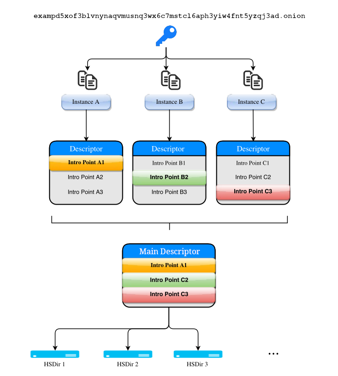

# Onionbalance v2 Installation Guide

!!! warning

    This section refers to the older v2 codebase.
    Although outdated, it's still available for historic purposes.

Onionbalance implements `round-robin` like load balancing on
top of Tor onion services. A typical Onionbalance deployment will
incorporate one management servers and multiple backend application
servers.

## Architecture

The management server runs the Onionbalance daemon. Onionbalance
combines the routing information (the introduction points) for multiple
backend onion services instances and publishes this information in a
master descriptor.

The backend application servers run a standard Tor onion service. When a
client connects to the public onion service they select one of the
introduction points at random. When the introduction circuit completes
the user is connected to the corresponding backend instance.

* **Management Server**: is the machine running the Onionbalance daemon. It
  needs to have access to the onion service private key corresponding for the
  desired onion address. This is the public onion address that users will
  request.

  This machine can be located geographically isolated from the machines hosting
  the onion service content. It does not need to serve any content.

* **Backend Instance**: each backend application server runs a Tor onion
  service with a unique onion service key.

!!! note

    The [onionbalance-config](../onionbalance-config.md) tool can be used to
    quickly generate keys and config files for your Onionbalance deployment.

The Onionbalance tool provide two command line tools:

> **onionbalance** acts as a long running daemon.
>
> **onionbalance-config** is a helper utility which eases the process of
> creating keys and configuration files for onionbalance and the backend
> Tor instances.

## Getting Started

To get started with setting up Onionbalance, please go to
[Installing Oniobalance (v2)](installing_ob.md).
